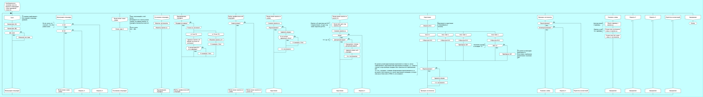
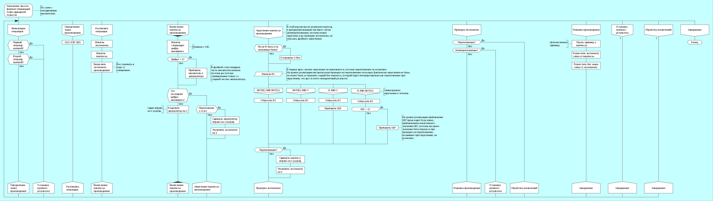
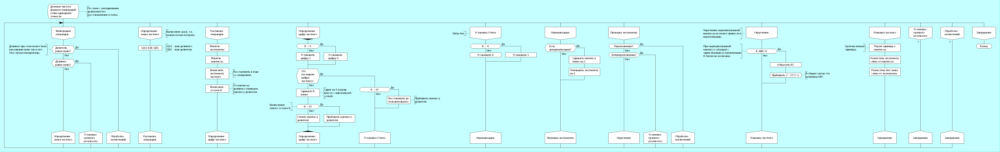
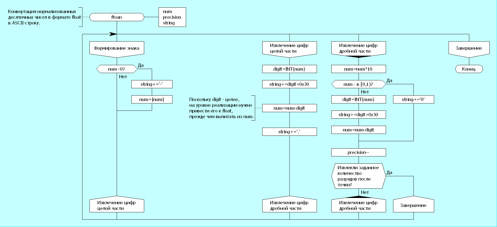
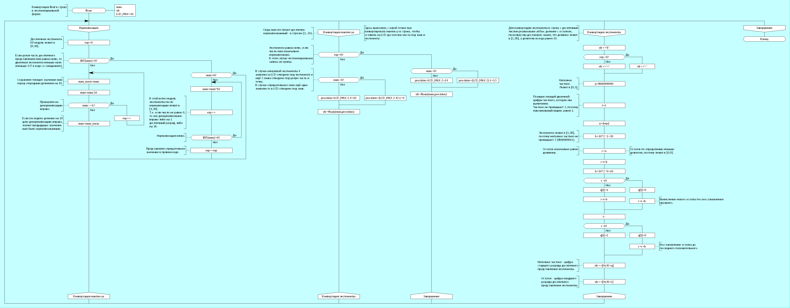
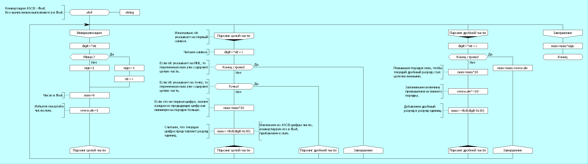

# Float32AVR

## Обзор

В этой библиотеке реализована программная эмуляция плавающей точки одинарной точности для AVR-микроконтроллеров. Все алгоритмы разработаны с нуля и формально обоснованы в сопуствующей документации.

Библиотека разработана в первую очередь в образовательных целях, позволяя пользователям изучить фундаментальные основы вычислений с плавающей точкой.

Эта библиотека используется в проекте "Hardware Calculator From Scratch", который находится [здесь](https://github.com/igor-240340/HardwareCalculatorFromScratch).

## Совместимость с IEEE 754

- Только один режим округления: к ближайшему/к четному.
- Нет денормализованных чисел: в случае антипереполнения происходит сброс до нуля.
- Нет спец. значений: inf, nan.
- Только положительный ноль.

## Ресерч и доказательства

Учебное руководство к проекту "Hardware Calculator From Scratch" содержит наиболее полное описание теории, в т.ч. арифметики с плавающей точкой. Найти его можно в репозитории, указанном выше.

Формальное доказательство алгоритма деления с неподвижным делителем можно найти [здесь](docs/Деление%двоичных%целых%чисел.odt) (в учебном руководстве приведено менее строгое, но более наглядное и интуитивное описание).

## Тесты

Отдельный репозиторий с набором тестовых числовых значений находится [здесь](https://github.com/igor-240340/Float32AVRTest). Каждый пример в этой библиотеке имеет эквивалент в указанном репозитории. Основная цель - убедиться, что наша эмуляция плавающей точки дает на выходе те же результаты, что и аппаратная реализация на десктопном процессоре, которую мы берем за эталон (конечно, исключая поведение в случае денормализованных чисел и спец. значений, которые мы не реализуем).

## Возможности

- **FADD32/FSUB32**: Сложение/вычитание.
- **FMUL32**: Умножение.
- **FDIV32**: Деление.
- **FTOAN**: Конвертирует float в ASCII-строку (поддерживает только десятичные нормализованные числа, использует простейший алгоритм, который в общем случае дает не самое лучшее двоичное приближение).
- **FTOAE**: Конвертирует float в ASCII-строку в экспоненциальном формате (внутри использует FTOAN).
- **ATOF**: Конвертирует ASCII-строку во float (использует простейший алгоритм, который в общем случае дает не самое лучшее двоичное приближение).
- **FTOI**: Преобразует float в int (только для внутреннего использования, поддерживает только целые числа в пределах байта).
- **ITOF**: Преобразует int во float (только для внутреннего использования, поддерживает только целые числа в пределах байта).

## Диаграммы
### FADD32

### FMUL32

### FDIV32

### FTOAN

### FTOAE

### ATOF

