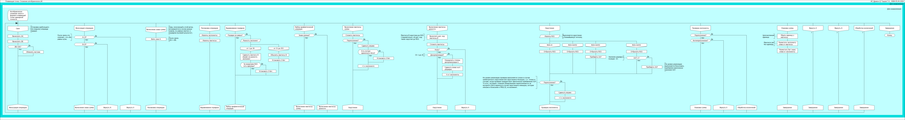

# Float32AVR

## Overview

This library provides floating-point routines with single precision for AVR microcontrollers. It has been built entirely from the ground up, with all floating-point algorithms developed based on fundamental binary arithmetic principles.

The main goal of this library is not for production use but rather for educational purposes, allowing users to understand and experiment with floating-point arithmetic. This library can be easily ported to any microcontroller unit (MCU).

## IEEE 754 Compliance

- Only one rounding mode: to nearest/ties to even.
- No subnormals: if underflows, it rounds to zero.
- No special values: inf, nan.
- Only positive zero.

## Research and Proofs

Some of the research notes can be found [here](https://drive.google.com/open?id=17ViZAw4rgcqFg06v3ZrvuvWtl1nly2Ic&usp=drive_fs).

A formal proof for the division algorithm with an immovable divisor can be found [here](https://drive.google.com/open?id=10WZpMqTUmbDx7oKYT3m1wm0OJeUH0PQj&usp=drive_fs). (I couldn't find a good one, so I had to write it myself.)

## Testing

An auxiliary repository with test examples is available [here](https://github.com/igor-240340/Float32AVRTest). Each test example in this library has a desktop equivalent in that repository. The primary goal is to ensure that our floating-point library produces the same results as hardware floating-point operations in a desktop environment (excluding behaviors for subnormals and inf/nan, which we do not support).

## Features

- **FADD32/FSUB32**: Addition/subtraction.
- **FMUL32**: Multiplication.
- **FDIV32**: Division.
- **FTOA**: Converts float to ASCII string (uses a simple algorithm that generally does not provide the best approximations).
- **ATOF**: Converts ASCII string to float (uses a simple algorithm that generally does not provide the best approximations).
- **FTOI**: Converts from float to int (intended for internal use by the library only, currently limited to integers with a size of 1 byte).
- **ITOF**: Converts from int to float (intended for internal use by the library only, currently limited to integers with a size of 1 byte).

## Flowcharts
### FADD32

### FMUL32

### FDIV32

### FTOA

